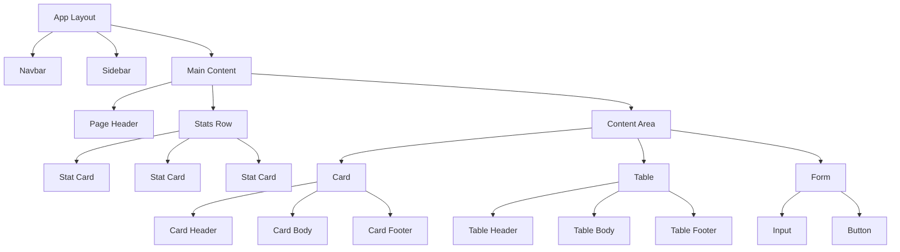
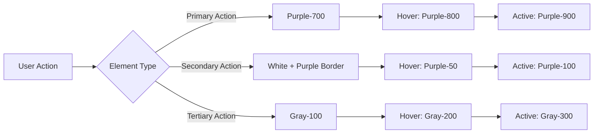
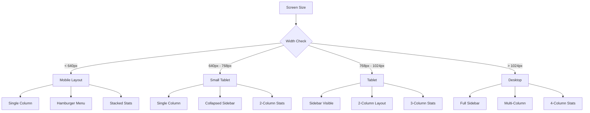

# Design Document

## Overview

This design document outlines the comprehensive redesign of the SmartPresence web application with a Facebook-inspired layout and a purple and white color scheme. The redesign will transform the current dark-themed interface into a modern, light-themed application that emphasizes clarity, social engagement, and ease of use.

The design follows Facebook's proven UI patterns including:
- Fixed top navigation bar with centered content
- Left sidebar navigation for dashboard pages
- Card-based content presentation
- Clean white backgrounds with purple accents
- Responsive mobile-first approach

## Architecture

### Design System Structure

```
Design System
├── Color Palette (Purple & White Theme)
├── Typography System
├── Spacing & Layout Grid
├── Component Library
│   ├── Base Components (Button, Input, Card)
│   ├── Layout Components (Navbar, Sidebar, Container)
│   └── Composite Components (Stats, Tables, Forms)
└── Page Templates
    ├── Authentication Pages
    ├── Dashboard Pages
    └── Content Pages
```

### Technology Stack

- **Framework**: Next.js 14 with App Router
- **Styling**: Tailwind CSS with custom configuration
- **Icons**: Lucide React
- **Animations**: Tailwind CSS animations + Framer Motion (optional)
- **Responsive**: Mobile-first approach with breakpoints at 640px, 768px, 1024px, 1280px

## Components and Interfaces

### 1. Color System

#### Primary Purple Palette

```css
--purple-50: #faf5ff;   /* Lightest - backgrounds */
--purple-100: #f3e8ff;  /* Very light - hover states */
--purple-200: #e9d5ff;  /* Light - borders */
--purple-300: #d8b4fe;  /* Medium light - disabled states */
--purple-400: #c084fc;  /* Medium - secondary actions */
--purple-500: #a855f7;  /* Base - secondary brand */
--purple-600: #9333ea;  /* Medium dark - hover states */
--purple-700: #7c3aed;  /* Primary brand color */
--purple-800: #6b21a8;  /* Dark - active states */
--purple-900: #581c87;  /* Very dark - text on light */
```

#### Neutral Palette (White & Grays)
```css
--white: #ffffff;       /* Primary background */
--gray-50: #f9fafb;     /* Secondary background */
--gray-100: #f3f4f6;    /* Tertiary background */
--gray-200: #e5e7eb;    /* Borders */
--gray-300: #d1d5db;    /* Dividers */
--gray-400: #9ca3af;    /* Placeholder text */
--gray-500: #6b7280;    /* Secondary text */
--gray-600: #4b5563;    /* Body text */
--gray-700: #374151;    /* Headings */
--gray-800: #1f2937;    /* Dark text */
--gray-900: #111827;    /* Darkest text */
```

#### Semantic Colors
```css
--success: #10b981;     /* Green for success states */
--warning: #f59e0b;     /* Amber for warnings */
--error: #ef4444;       /* Red for errors */
--info: #3b82f6;        /* Blue for information */
```

### 2. Typography System

#### Font Families
- **Primary**: Inter (sans-serif) - for body text and UI elements
- **Display**: Inter (sans-serif) - for headings with increased weight
- **Monospace**: JetBrains Mono - for code and session codes

#### Type Scale
```css
--text-xs: 0.75rem;     /* 12px - captions, labels */
--text-sm: 0.875rem;    /* 14px - body text, buttons */
--text-base: 1rem;      /* 16px - default body */
--text-lg: 1.125rem;    /* 18px - emphasized text */
--text-xl: 1.25rem;     /* 20px - small headings */
--text-2xl: 1.5rem;     /* 24px - section headings */
--text-3xl: 1.875rem;   /* 30px - page headings */
--text-4xl: 2.25rem;    /* 36px - hero headings */
```

#### Font Weights
- Regular: 400 (body text)
- Medium: 500 (emphasized text)
- Semibold: 600 (headings, labels)
- Bold: 700 (important headings)

### 3. Spacing System

Following an 8px base unit:
```css
--space-1: 0.25rem;   /* 4px */
--space-2: 0.5rem;    /* 8px */
--space-3: 0.75rem;   /* 12px */
--space-4: 1rem;      /* 16px */
--space-5: 1.25rem;   /* 20px */
--space-6: 1.5rem;    /* 24px */
--space-8: 2rem;      /* 32px */
--space-10: 2.5rem;   /* 40px */
--space-12: 3rem;     /* 48px */
--space-16: 4rem;     /* 64px */
```

### 4. Layout Components

#### Navbar Component
**Purpose**: Fixed top navigation bar present on all pages

**Structure**:
```
┌─────────────────────────────────────────────────────────┐
│ [Logo] [Search]    [Nav Links]    [Notifications] [User]│
└─────────────────────────────────────────────────────────┘
```

**Specifications**:
- Height: 60px (desktop), 56px (mobile)
- Background: White with subtle shadow
- Border bottom: 1px solid gray-200
- Position: Fixed top
- Z-index: 50
- Logo: Purple gradient icon + text
- Search bar: Centered, expandable on mobile
- User menu: Avatar with dropdown

**Responsive Behavior**:
- Mobile (<768px): Hide nav links, show hamburger menu
- Tablet (768px-1024px): Show essential nav links
- Desktop (>1024px): Show all nav links

#### Sidebar Component
**Purpose**: Left navigation for dashboard pages

**Structure**:
```
┌──────────────┐
│ [Dashboard]  │
│ [Sessions]   │
│ [Reports]    │
│ [Settings]   │
│              │
│ [Logout]     │
└──────────────┘
```

**Specifications**:
- Width: 240px (desktop), full-width drawer (mobile)
- Background: White
- Border right: 1px solid gray-200
- Position: Fixed left (desktop), overlay (mobile)
- Active item: Purple background (purple-50) with purple-700 text
- Hover: Gray-50 background
- Icons: 20px, aligned left with 12px spacing to text

**Responsive Behavior**:
- Mobile: Collapsible drawer triggered by hamburger
- Desktop: Always visible, fixed position

#### Container Component
**Purpose**: Content wrapper with max-width and padding

**Specifications**:
- Max-width: 1280px
- Padding: 16px (mobile), 24px (tablet), 32px (desktop)
- Margin: 0 auto (centered)

### 5. Base Components

#### Button Component

**Variants**:

1. **Primary Button**
   - Background: purple-700
   - Text: white
   - Hover: purple-800
   - Active: purple-900
   - Shadow: subtle
   - Border radius: 8px
   - Padding: 10px 20px (medium)

2. **Secondary Button**
   - Background: white
   - Text: purple-700
   - Border: 1px solid purple-700
   - Hover: purple-50 background
   - Border radius: 8px

3. **Ghost Button**
   - Background: transparent
   - Text: gray-700
   - Hover: gray-100 background
   - Border radius: 8px

4. **Outline Button**
   - Background: white
   - Text: gray-700
   - Border: 1px solid gray-300
   - Hover: gray-50 background
   - Border radius: 8px

**Sizes**:
- Small: 8px 16px, text-sm
- Medium: 10px 20px, text-sm
- Large: 12px 24px, text-base

**States**:
- Default: Normal appearance
- Hover: Darker/lighter background
- Active: Pressed appearance (scale 0.98)
- Disabled: 50% opacity, cursor not-allowed
- Loading: Spinner icon, disabled state

#### Input Component

**Specifications**:
- Background: white
- Border: 1px solid gray-300
- Border radius: 8px
- Padding: 10px 12px
- Font size: 14px
- Placeholder: gray-400

**States**:
- Default: gray-300 border
- Focus: purple-700 border, purple-100 ring (2px)
- Error: red-500 border, red-100 ring
- Disabled: gray-100 background, gray-400 text
- Success: green-500 border

**Variants**:
- Text input
- Email input
- Password input (with show/hide toggle)
- Textarea (auto-resize)
- Select dropdown

#### Card Component

**Specifications**:
- Background: white
- Border: 1px solid gray-200
- Border radius: 12px
- Padding: 24px
- Shadow: subtle (0 1px 3px rgba(0,0,0,0.1))

**Hover State** (for interactive cards):
- Shadow: medium (0 4px 6px rgba(0,0,0,0.1))
- Transform: translateY(-2px)
- Border: gray-300

**Variants**:
- Default: Standard card
- Elevated: Larger shadow
- Outlined: No shadow, prominent border
- Flat: No shadow, no border

### 6. Composite Components

#### Stats Card Component

**Purpose**: Display key metrics in dashboard

**Structure**:
```
┌─────────────────────┐
│ [Icon]              │
│ [Large Number]      │
│ [Label]             │
│ [Trend Indicator]   │
└─────────────────────┘
```

**Specifications**:
- Background: White card
- Icon: Purple-700 in purple-100 circle (48px)
- Number: text-3xl, font-bold, gray-900
- Label: text-sm, gray-600
- Trend: Green (up) or red (down) with arrow
- Padding: 24px
- Border radius: 12px

#### Table Component

**Specifications**:
- Background: White
- Header: gray-50 background, gray-700 text, font-semibold
- Rows: Alternating white and gray-50
- Hover: purple-50 background
- Border: gray-200 between rows
- Cell padding: 12px 16px
- Font size: 14px

**Responsive**:
- Mobile: Horizontal scroll or card view
- Desktop: Full table view

#### Navigation Menu Component

**Purpose**: Sidebar navigation items

**Specifications**:
- Item height: 44px
- Padding: 12px 16px
- Border radius: 8px
- Icon size: 20px
- Text: 14px, medium weight

**States**:
- Default: gray-700 text
- Hover: gray-100 background
- Active: purple-50 background, purple-700 text, purple-700 icon
- Disabled: gray-400 text, cursor not-allowed

## Data Models

### Theme Configuration Object

```javascript
const theme = {
  colors: {
    primary: {
      50: '#faf5ff',
      // ... full purple scale
      700: '#7c3aed', // Main brand color
    },
    neutral: {
      white: '#ffffff',
      // ... full gray scale
    },
    semantic: {
      success: '#10b981',
      warning: '#f59e0b',
      error: '#ef4444',
      info: '#3b82f6',
    }
  },
  typography: {
    fontFamily: {
      sans: ['Inter', 'sans-serif'],
      mono: ['JetBrains Mono', 'monospace'],
    },
    fontSize: {
      // ... type scale
    }
  },
  spacing: {
    // ... spacing scale
  },
  borderRadius: {
    sm: '4px',
    md: '8px',
    lg: '12px',
    xl: '16px',
    full: '9999px',
  },
  shadows: {
    sm: '0 1px 2px rgba(0,0,0,0.05)',
    md: '0 4px 6px rgba(0,0,0,0.1)',
    lg: '0 10px 15px rgba(0,0,0,0.1)',
  }
}
```

## Page Designs

### 1. Login Page

**Layout**:
```
┌─────────────────────────────────────┐
│                                     │
│         [Logo]                      │
│         SmartPresence               │
│                                     │
│    ┌─────────────────────┐         │
│    │  Login Card         │         │
│    │  [Email Input]      │         │
│    │  [Password Input]   │         │
│    │  [Login Button]     │         │
│    └─────────────────────┘         │
│                                     │
│    [Demo Credentials]               │
└─────────────────────────────────────┘
```

**Specifications**:
- Background: Purple gradient (purple-50 to purple-100)
- Login card: White, centered, max-width 400px
- Logo: Purple gradient icon, 64px
- Heading: text-3xl, gray-900
- Inputs: Full width with icons
- Button: Full width, primary purple
- Demo credentials: Small card below, gray-100 background

### 2. Dashboard Pages (Admin/Teacher/Student)

**Layout**:
```
┌─────────────────────────────────────────────────┐
│ Navbar (Fixed Top)                              │
├──────────┬──────────────────────────────────────┤
│ Sidebar  │ Main Content Area                    │
│          │                                       │
│ [Nav 1]  │ [Page Header]                        │
│ [Nav 2]  │                                       │
│ [Nav 3]  │ [Stats Cards Row]                    │
│          │ ┌────┐ ┌────┐ ┌────┐                │
│          │ │Stat│ │Stat│ │Stat│                │
│          │ └────┘ └────┘ └────┘                │
│          │                                       │
│          │ [Content Cards/Tables]               │
│          │ ┌─────────────────────┐              │
│          │ │                     │              │
│          │ │                     │              │
│          │ └─────────────────────┘              │
└──────────┴──────────────────────────────────────┘
```

**Specifications**:
- Background: gray-50
- Sidebar: White, 240px width
- Main content: Padding 32px
- Page header: text-3xl, gray-900, margin-bottom 24px
- Stats row: Grid, 3 columns (desktop), 1 column (mobile)
- Content cards: White background, 24px padding

### 3. Session Create/View Pages

**Layout**: Similar to dashboard with form-focused content

**Specifications**:
- Form container: White card, max-width 800px, centered
- Form sections: Divided by gray-200 borders
- Labels: text-sm, gray-700, font-medium
- Inputs: Full width within form
- Action buttons: Right-aligned, primary + secondary

### 4. Tables/Lists Pages

**Layout**: Full-width table within content area

**Specifications**:
- Table container: White card
- Header: gray-50 background, sticky on scroll
- Rows: Hover effect with purple-50
- Actions column: Right-aligned buttons
- Pagination: Bottom, centered

## Error Handling

### Form Validation

**Visual Feedback**:
- Error state: Red border (red-500), red text below input
- Success state: Green border (green-500), green checkmark icon
- Warning state: Amber border (amber-500), amber text

**Error Messages**:
- Position: Below input field
- Font size: text-sm
- Color: red-600
- Icon: Alert circle (16px)

### Empty States

**Specifications**:
- Icon: gray-300, 64px
- Heading: text-xl, gray-700
- Description: text-sm, gray-500
- Action button: Primary purple
- Centered in container

### Loading States

**Specifications**:
- Spinner: Purple-700, 24px (inline), 48px (full page)
- Skeleton screens: gray-200 background with shimmer animation
- Button loading: Spinner replaces icon, text changes to "Loading..."

## Testing Strategy

### Visual Regression Testing

1. **Component Testing**
   - Test each component variant in isolation
   - Test all states (default, hover, active, disabled)
   - Test responsive breakpoints

2. **Page Testing**
   - Test each page layout at all breakpoints
   - Test with different content lengths
   - Test empty states and error states

3. **Cross-browser Testing**
   - Chrome, Firefox, Safari, Edge
   - Mobile browsers (iOS Safari, Chrome Mobile)

### Accessibility Testing

1. **Color Contrast**
   - Ensure WCAG AA compliance (4.5:1 for normal text)
   - Test with color blindness simulators

2. **Keyboard Navigation**
   - All interactive elements accessible via keyboard
   - Visible focus indicators (purple-700 ring)
   - Logical tab order

3. **Screen Reader Testing**
   - Proper ARIA labels
   - Semantic HTML structure
   - Alt text for images/icons

### Responsive Testing

1. **Breakpoints**
   - Mobile: 375px, 414px
   - Tablet: 768px, 1024px
   - Desktop: 1280px, 1920px

2. **Touch Targets**
   - Minimum 44x44px for all interactive elements
   - Adequate spacing between touch targets

## Implementation Notes

### CSS Architecture

1. **Tailwind Configuration**
   - Extend default theme with purple palette
   - Add custom utilities for Facebook-style components
   - Configure responsive breakpoints

2. **Custom CSS**
   - Minimal custom CSS, prefer Tailwind utilities
   - Use CSS variables for theme values
   - Organize in layers: base, components, utilities

### Component Structure

1. **File Organization**
   ```
   src/components/
   ├── ui/              # Base components
   │   ├── Button.js
   │   ├── Input.js
   │   ├── Card.js
   │   └── ...
   ├── layout/          # Layout components
   │   ├── Navbar.js
   │   ├── Sidebar.js
   │   └── Container.js
   └── composite/       # Composite components
       ├── Stats.js
       ├── Table.js
       └── ...
   ```

2. **Component Props**
   - Use TypeScript or PropTypes for type safety
   - Provide sensible defaults
   - Support className prop for customization

### Animation Guidelines

1. **Transitions**
   - Duration: 150-300ms
   - Easing: ease-in-out
   - Properties: transform, opacity, colors

2. **Hover Effects**
   - Subtle scale (1.02) or translateY(-2px)
   - Color transitions
   - Shadow changes

3. **Page Transitions**
   - Fade in: 200ms
   - Slide in: 300ms
   - Avoid jarring animations

### Performance Considerations

1. **Image Optimization**
   - Use Next.js Image component
   - Lazy load images below fold
   - Provide appropriate sizes

2. **Code Splitting**
   - Dynamic imports for heavy components
   - Route-based code splitting (automatic with Next.js)

3. **CSS Optimization**
   - Purge unused Tailwind classes
   - Minimize custom CSS
   - Use CSS containment where appropriate

## Design Rationale

### Why Purple and White?

1. **Purple**: Conveys creativity, wisdom, and modernity. It's distinctive and less commonly used than blue, making the application memorable.

2. **White**: Provides clarity, cleanliness, and professionalism. It maximizes readability and creates a spacious feel.

3. **Combination**: The purple and white combination offers high contrast for accessibility while maintaining a modern, friendly aesthetic.

### Why Facebook-inspired Layout?

1. **Familiarity**: Users are already comfortable with Facebook's layout patterns, reducing learning curve.

2. **Proven UX**: Facebook's design has been refined through extensive user testing and iteration.

3. **Scalability**: The layout pattern scales well from mobile to desktop and accommodates various content types.

4. **Engagement**: Card-based layouts and fixed navigation encourage exploration and engagement.

## Mermaid Diagrams

### Component Hierarchy



### Color Usage Flow



### Responsive Breakpoint Strategy



This design provides a comprehensive foundation for implementing the Facebook-inspired purple and white theme across the entire SmartPresence application.
